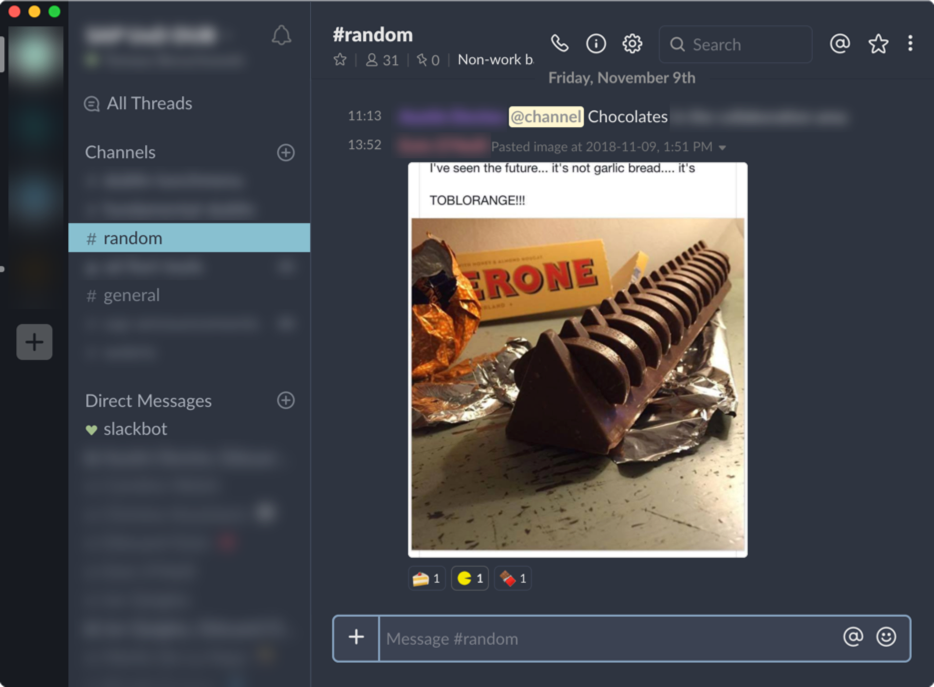

# slack-nord-theme
Going full nord!


Inspired by (and mostly "borrowed" from) the amazing slack night-mode: https://github.com/laCour/slack-night-mode this paints the whole slack window with the nord colours:




## Installation for Slack >= 4.0
Just run (only once!):
```sh
./install.sh
```

To revert:
```sh
./install.sh --revert
```


## Installation for Slack < 4.0
1. First apply the official theme to the sidebar: https://github.com/arcticicestudio/nord-slack
2. Close slack
3. Open this file in editor:
    ```sh
    /Applications/Slack.app/Contents/Resources/app.asar.unpacked/src/static/ssb-interop.js
    ```
4. Append this code:
    ```js
    document.addEventListener('DOMContentLoaded', function() {
     $.ajax({
       url: 'https://raw.githubusercontent.com/tborychowski/slack-nord-theme/master/slack-nord.css',
       success: function(css) {
         $("<style></style>").appendTo('head').html(css);
       }
     });
    });
    ```
5. Open slack and enjoy the nord darkness!

**Note:** The unfortunate thing is that this must be re-done every time after the slack app gets updated.


## Development

#### Slack devtools
```sh
export SLACK_DEVELOPER_MENU=true
open -a /Applications/Slack.app
```

Open dev tools from View menu & inspect stuff.


## Contribution
PRs with screens (before & after) are welcomed!
